# Samiti App

A Flutter Vehicle Management System built with an **offline-first approach**. This app allows users to manage vehicles and record accidents seamlessly, even without an internet connection. Data syncs automatically when the device comes back online.

## Screenshots

<p align="center">
  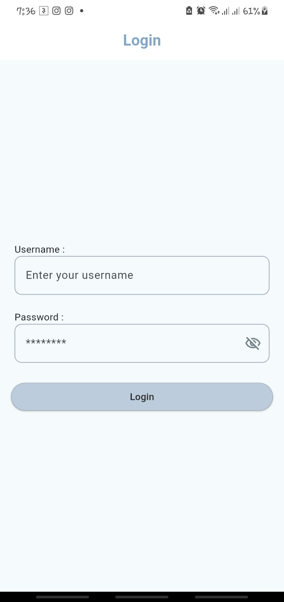
  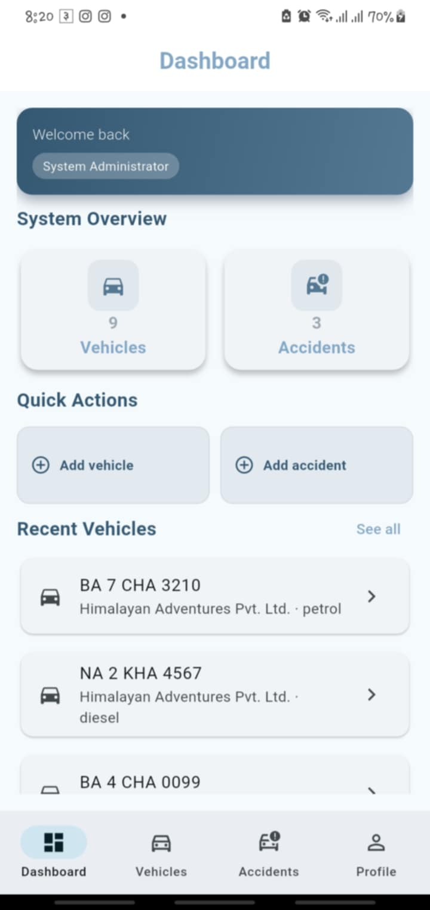
  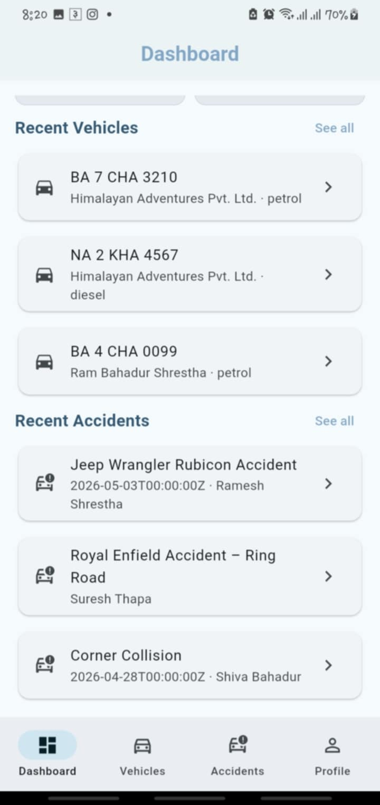
  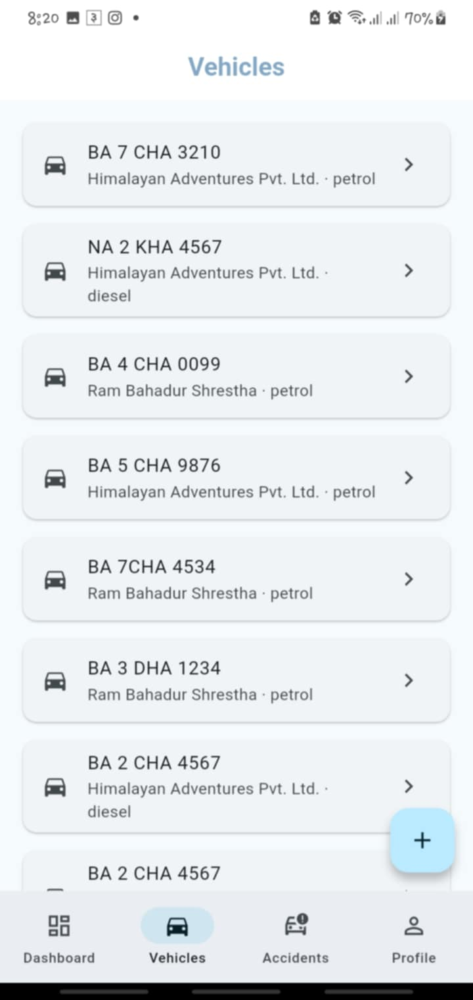
</p>

<p align="center">
  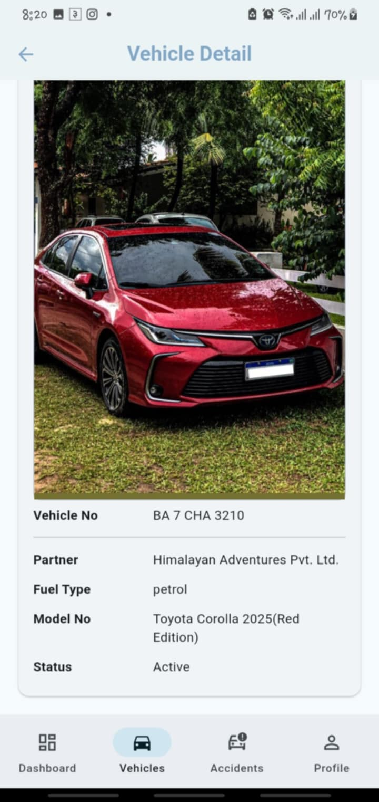
  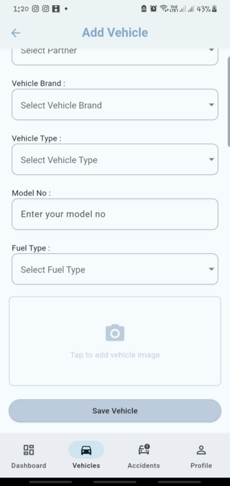
  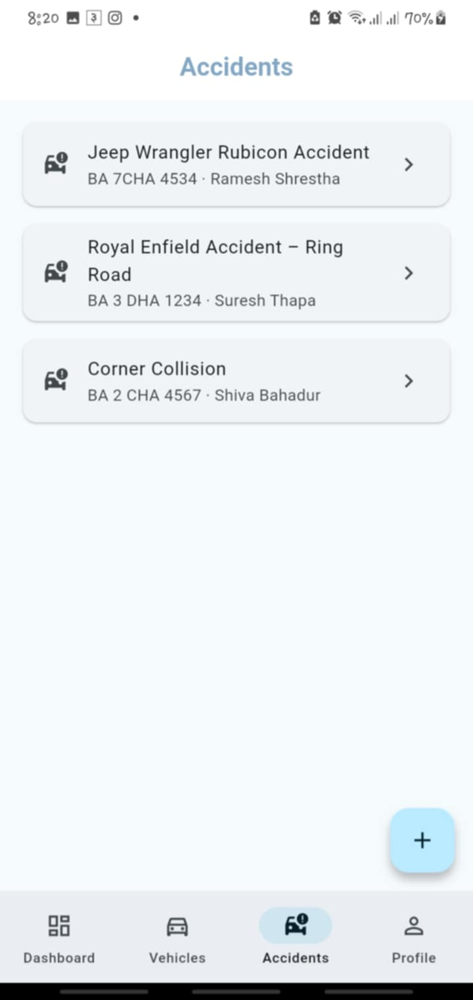
  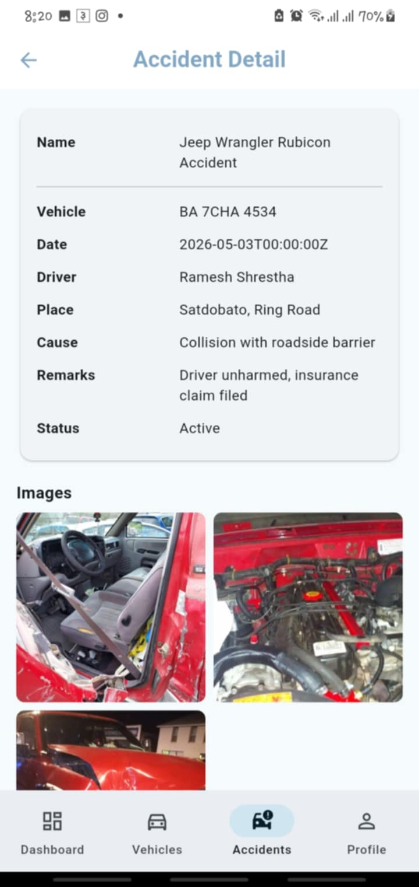
</p>

<p align="center">
  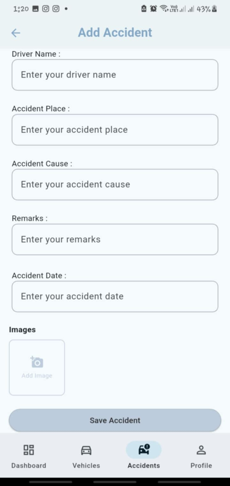
  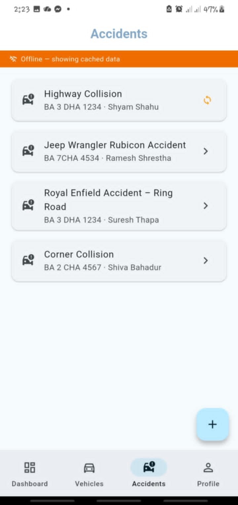
  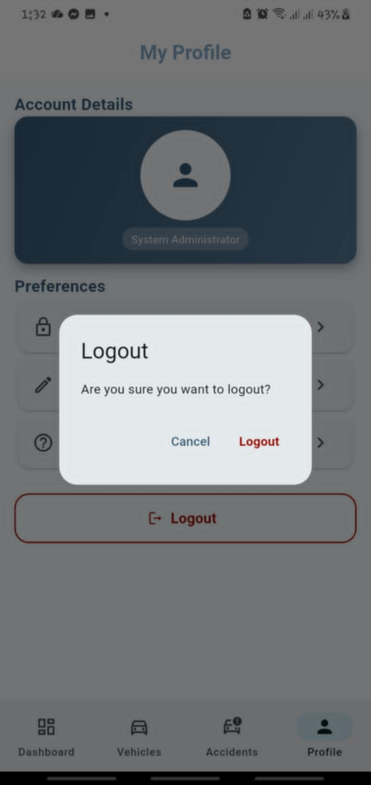
</p>

---

## What This App Does

- **Add Vehicles** — Register new vehicles with full details
- **Record Accidents** — Log accident reports with multiple images
- **Offline-First** — Works fully without internet; queues changes locally
- **Auto Sync** — Automatically syncs data with the server when back online
- **CRUD Operations** — Create, Read, Update, Delete vehicles and accidents
- **Multiple Image Upload** — Attach several images to accident reports
- **Authentication** — Secure login for authorized users

&gt; **Note:** Accounts created through the signup screen do not create valid login credentials. Admin login is handled separately.

## What I Learned

- **Offline-First Architecture** — Building apps that work without constant connectivity
- **Auto Sync Mechanism** — Queueing local changes and syncing when online
- **API Integration** — Connecting to backend services for data sync
- **CRUD Operations** — Full create, read, update, delete via REST API
- **Multiple Image Upload** — Handling batch image uploads with proper state management
- **Authentication** — Secure user sessions and token-based login
- **MVVM Architecture** — Clean separation with Model-View-ViewModel pattern
- **Clean Architecture** — Layered code structure for maintainability
- **Local Database** — SQLite for persistent offline data storage

## Tech Stack

- **Flutter**
- **Dart**
- **SQLite** (local storage)
- **REST API** (sync backend)

## Project Structure
```
lib/
├── core/
│   ├── api/
│   │   ├── api_constants.dart
│   │   ├── api_service.dart
│   │   └── app_providers.dart
│   ├── constants/
│   │   └── app_colors.dart
│   ├── database/
│   │   ├── db_helper.dart
│   │   └── outbox_local_db.dart
│   ├── di/
│   │   └── service_locator.dart
│   ├── exception/
│   │   └── api_exception.dart
│   ├── network/
│   │   └── connectivity_service.dart
│   ├── reusable_widgets/
│   │   ├── custom_action_card.dart
│   │   ├── custom_appbar.dart
│   │   ├── custom_card.dart
│   │   ├── custom_dropdown.dart
│   │   ├── custom_quick_action_tiles.dart
│   │   ├── custom_text_field.dart
│   │   ├── section_header.dart
│   │   ├── vehicle_image.dart
│   │   └── wide_elevated_button.dart
│   ├── router/
│   │   └── app_router.dart
│   ├── sync/
│   │   └── sync_engine.dart
│   └── utils/
│       ├── date_formatter.dart
│       ├── image_cache_helper.dart
│       ├── jwt_decoder.dart
│       └── token_storage.dart
│
├── features/
│   ├── accident/
│   │   ├── api/
│   │   │   └── accident_api.dart
│   │   ├── localdb/
│   │   │   └── accident_local_db.dart
│   │   ├── model/
│   │   │   └── accident_model.dart
│   │   ├── repository/
│   │   │   └── accident_repository.dart
│   │   ├── view/
│   │   │   ├── accident_detail_screen.dart
│   │   │   ├── accident_form_screen.dart
│   │   │   └── accident_list_screen.dart
│   │   └── view_model/
│   │       └── accident_view_model.dart
│   │
│   ├── auth/
│   │   ├── model/
│   │   │   └── auth_model.dart
│   │   ├── repository/
│   │   │   └── auth_repository.dart
│   │   ├── view/
│   │   │   ├── login_screen.dart
│   │   │   └── profile_screen.dart
│   │   └── view_model/
│   │       └── auth_view_model.dart
│   │
│   ├── dashboard/
│   │   ├── dashboard_screen.dart
│   │   └── main_shell.dart
│   │
│   └── vehicle/
│       ├── api/
│       │   └── vehicle_api.dart
│       ├── localdb/
│       │   └── vehicle_local_db.dart
│       ├── model/
│       │   └── vehicle_model.dart
│       ├── repository/
│       │   └── vehicle_repository.dart
│       ├── view/
│       │   ├── vehicle_detail_screen.dart
│       │   ├── vehicle_form_screen.dart
│       │   └── vehicle_list_screen.dart
│       └── view_model/
│           └── vehicle_view_model.dart
│
└── main.dart
```

## Getting Started

1. Clone the repository
2. Run `flutter pub get` to install dependencies
3. Run `flutter run` to start the app
